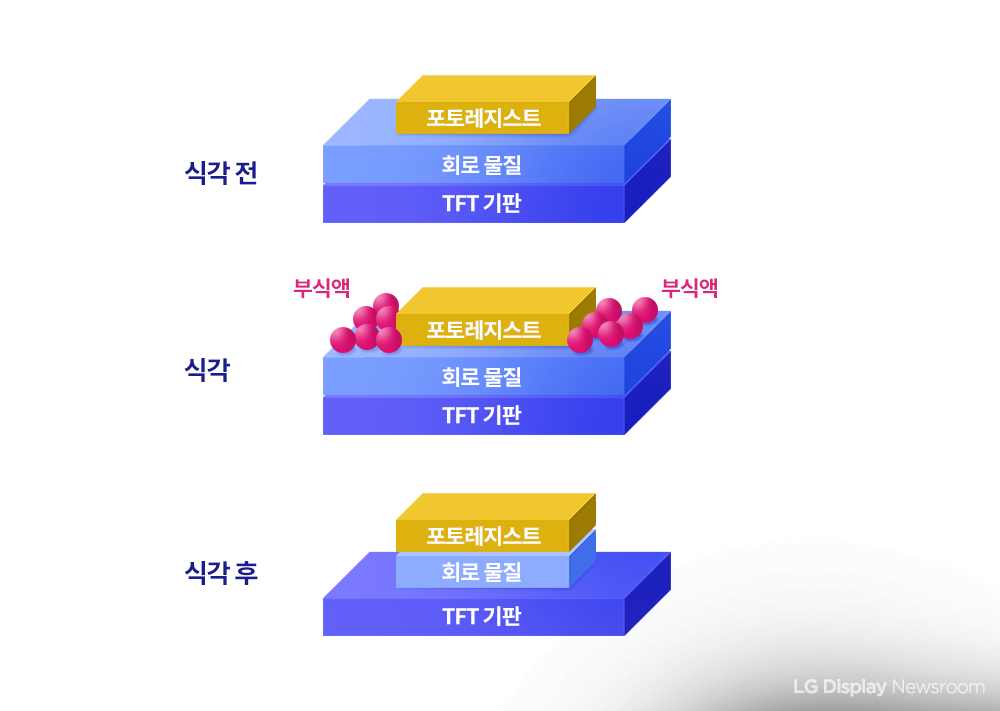

# 제조 현장 데이터 분석 및 불량 탐지 실습

## 실습 개요
반도체 제조 공정 중 **식각** 단계에서 수집된 센서 데이터를 분석하고 불량품을 탐지하는 머신러닝 모델을 구축

### 식각(Etching)이란?
회로패턴 공정 중 필요한 부분을 남기고 나머지 **불필요한 부분을 부식액을 이용해 제거하는 과정**



- **식각 전**: 포토레지스트로 보호된 기판
- **식각**: 부식액으로 불필요한 부분 제거
- **식각 후**: 필요한 회로 패턴만 남음

> 📚 출처: [LG Display - 디스플레이 상식사전](https://news.lgdisplay.com/2022/12/%EB%94%94%EC%8A%A4%ED%94%8C%EB%A0%88%EC%9D%B4-%EC%83%81%EC%8B%9D%EC%82%AC%EC%A0%84-22-%EC%8B%9D%EA%B0%81-etching/)

---

## 실습 구성

### 실습 A: 지도학습 기반 불량 탐지
MLP(Multi-Layer Perceptron) 신경망을 사용한 불량품 분류 모델 학습
- 데이터 전처리 (결측치 처리, 정규화)
- MLP 모델 학습
- 성능 평가 (Accuracy, Precision, Recall, F1, ROC-AUC)
- 혼동 행렬 분석

### 실습 B: 비지도학습 기반 이상 패턴 분석
클러스터링을 활용한 정상 패턴 학습 및 이상 탐지
- 정상 데이터의 센서 상관관계 분석
- Stage별 상관관계 패턴 추출
- K-Means 클러스터링으로 정상 작동 모드 학습
- 차원 축소 시각화 (PCA, t-SNE)

---

## 학습 목표

✅ 실제 제조 현장 데이터 전처리 경험  
✅ 지도학습/비지도학습 모두 활용한 불량 탐지  
✅ 다양한 평가 지표를 통한 모델 성능 분석  
✅ 센서 간 상관관계 패턴 분석 및 시각화  

---

## 데이터셋 소개

### 데이터 구조
- **5개 Stage**: 식각 공정의 5단계
- **8종류 센서**: 각 Stage마다 측정
  - `temp`: 공정 온도
  - `humidity`: 공정 습도
  - `flow_deviation`: 공정 생산약품의 유량 차이
  - `density_deviation`: 공정 생산약품의 밀도 차이
  - `viscosity_deviation`: 공정 생산약품의 점도 차이
  - `co2_deviation`: 공정반응에서 발생한 산소 농도 차이
  - `o2_deviation`: 공정반응에서 발생한 질소 농도 차이
  - `n_deviation`: 공정반응에서 발생한 이산화탄소 농도 차이

- **총 40개 Feature**: 5 Stages × 8 Sensors
- **Label**: 생산된 정상 혹은 불량 (0: 정상, 1: 불량)

> 💡 **deviation**(표준값 대비 차이): 공정 중 측정값이 표준 기준값에서 얼마나 벗어났는지를 나타냄

> 📚 출처: [Samsung Brightics AI 커뮤니티](https://news.lgdisplay.com/2022/12/%EB%94%94%EC%8A%A4%ED%94%8C%EB%A0%88%EC%9D%B4-%EC%83%81%EC%8B%9D%EC%82%AC%EC%A0%84-22-%EC%8B%9D%EA%B0%81-etching/)
---

## 실습 파일 준비

### 방법 1: GitHub에서 다운로드

1. Repository 우측 상단 **`<> Code`** 버튼 클릭
2. **`Download ZIP`** 선택하여 다운로드
3. 압축 해제 후 Google Drive에 업로드하여 `DefectDetection.ipynb` 실행

### 방법 2: Google Colab에서 바로 실행

1. Colab 접속: [https://colab.research.google.com/](https://colab.research.google.com/)
2. 새 파일 만들고 아래 수행

#### Step 1: 드라이브 마운트
```python
# 드라이브 마운트 하기
from google.colab import drive
drive.mount('/content/drive')
```

#### Step 2: 드라이브로 이동
```python
# 드라이브로 이동
cd /content/drive/My Drive
```

#### Step 3: Repository Clone
```python
# Repository clone (기져오기)
!git clone https://github.com/nkim71-dev/manufacturing_251204.git
```

#### Step 4: 폴더 이동 및 파일 확인
```python
# clone한 폴더로 이동
cd manufacturing_251204

# 파일 확인
!ls -la
```

#### Step 5: 노트북 실행
- 좌측 파일 탐색기 혹은 Google Drive에서 `defect_detection.ipynb` 열기
- 순서대로 셀 실행 (Shift+Enter / Ctrl+Enter)

> ⚠️ **주의**: Colab에서 실행 시 데이터 파일 경로를 현재 위치에 맞게 수정해야 할 수 있습니다.
---

## 필요 환경

### Python 라이브러리
```bash
pip install pandas numpy scikit-learn matplotlib seaborn
```

### 주요 라이브러리
- `pandas`, `numpy`: 데이터 처리
- `scikit-learn`: 머신러닝 모델 및 전처리
- `matplotlib`, `seaborn`: 데이터 시각화

---

> [발표자료](https://docs.google.com/presentation/d/1SD4JUnGpqX2mVBVKdeVWhygBnZW-seVZ/edit?usp=sharing&ouid=101113300068164697807&rtpof=true&sd=true)

